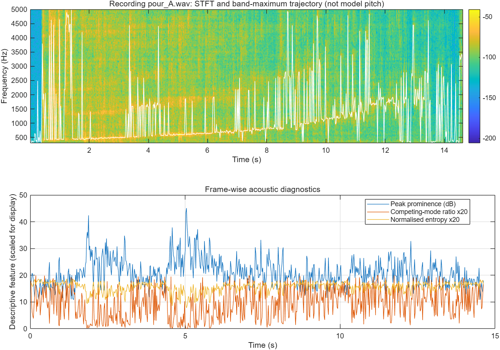
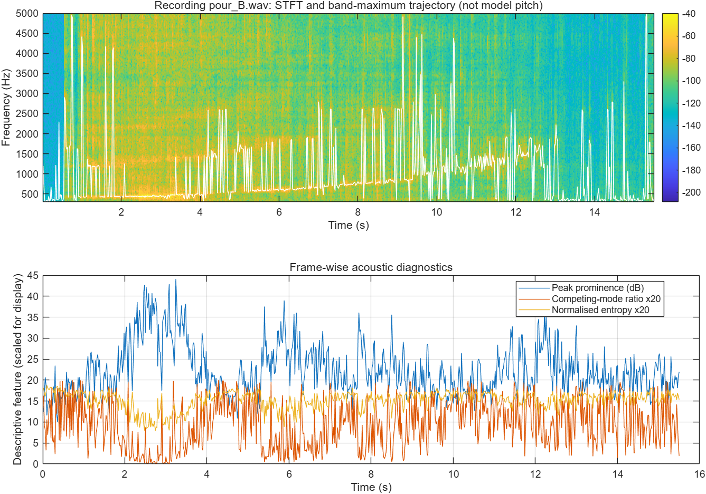

# When Can Pouring-Sound Fill-Level Estimates Be Trusted?

**ELEC5305 project progress submission | 9 October 2026**  
**Student:** Yueyao Lyu  
**Project website:** https://lyu-ui.github.io/elec5305-project-540568813/  
**Repository:** https://github.com/lyu-ui/elec5305-project-540568813

## Revised question
**Can interpretable spectro-temporal features indicate when physics-based pouring-sound fill-level estimates are reliable or unreliable, particularly for unseen container geometries and competing resonances?**

The original proposal compared audio representations for four fill classes. After feedback, this work instead investigates the acoustics behind estimator failures, building on Bagad et al. (2026), rather than duplicating a generic classifier.

## Progress so far (verified existing work)
- Obtained two public *Sound of Water* pouring recordings, A and B, from the **same annotated container**; provenance and original filenames are in `docs/DATA_PROVENANCE.md`.
- Implemented FFT and a base-MATLAB STFT with a periodic Hann window and explicit power spectral density scaling (`matlab/ap_stft.m`).
- Compared 10, 40 and 100 ms windows, 0%, 50% and 75% overlap, zero-padding, resampling/anti-aliasing, noise filtering, and STFT reconstruction in Report 1.
- Extracted descriptive frame features: band maximum (not a validated pitch), spectral centroid, spread, 90%-energy roll-off, and RMS energy. Results are saved under `results/`.
- **New progress diagnostic:** `matlab/run_reliability_features.m` calculates band-peak prominence, ratio of a second spectral peak, peak-frequency jumps, and normalized spectral entropy. These are hypotheses to test against future *physical-estimation error*, not yet established reliability predictors.

## Early descriptive results (existing Report 1)
The original baseline used a 40 ms Hann window, 50% overlap and 8192-point FFT. Within the 300–5000 Hz search band, median spectral-maximum frequency rose from **503.9 to 1593.8 Hz (A)** and **468.8 to 996.1 Hz (B)** between the early and late thirds. The peak is **not equivalent to fundamental pitch**; thirds are **not actual liquid-level ground truth**. Recording A's median spectral centroid changed from 1946.2 to 1832.1 Hz and B's from 1727.4 to 1467.0 Hz. These comparisons support a time-varying spectral analysis only; they do **not** establish air-column/fill-height accuracy.

| Recording | Early band maximum (Hz) | Late band maximum (Hz) | Early centroid (Hz) | Late centroid (Hz) |
|:--|--:|--:|--:|--:|
| A | 503.9 | 1593.8 | 1946.2 | 1832.1 |
| B | 468.8 | 996.1 | 1727.4 | 1467.0 |

## New diagnostic figures and frame-level data
The GitHub Pages [project site](https://lyu-ui.github.io/elec5305-project-540568813/) shows both newly generated MATLAB diagnostic figures directly. The images are saved in `results/` and are also embedded below.

*Figure 1. Recording A: STFT, white band-maximum track, and exploratory acoustic diagnostics. The band maximum is not validated pitch.*

*Figure 2. Recording B: frequency tracking includes sudden jumps, but these have not yet been linked to physical estimation error.*

Frame-level outputs: [`results/preliminary_reliability_features.csv`](results/preliminary_reliability_features.csv). The competing-mode ratio and spectral entropy curves are multiplied by 20 for display, whereas the CSV retains their original scales.

## Official reproduction progress (in progress)
In the authors' `playground.ipynb` example, I loaded the supplied example video and metadata, produced the Log-Mel spectrogram, and plotted the physics-derived *reference* pitch trajectory. I also downloaded the official real-finetuned checkpoint and prepared local/Colab Python GPU environments. **Pretrained model inference has not yet produced a verified predicted-pitch trajectory.** The reference curve from the notebook is computed using metadata/physics, **not** the neural network's output and not an independently measured pitch trace. No model inference plots are claimed in this repository yet.

## What is not yet completed
The official pretrained inference pipeline has **not been reproduced** in the supplied Report 1 materials. No reference air-column lengths, continuous prediction MAE, seen/unseen-container comparison, or reliability-score/selective-prediction validation is yet available. The two recordings are from the same container, so they cannot measure cross-container generalisation. Do not interpret any plot here as validated error prediction.

## Next technical milestones
1. Reproduce the authors' pretrained Python inference pipeline on selected clean and difficult clips; save its estimated pitch/air-column trajectory and align it with reference values where supplied.
2. Use official seen/unseen container splits (no leakage between segments of a recording), add shape metadata, and calculate true physical estimation error.
3. Relate peak prominence, competing modes, ridge continuity, and entropy to observed error. Inspect failures and model mismatch rather than just comparing pitch algorithms.
4. Train/tune a simple, interpretable reliability threshold **on development data only**, freeze it, and evaluate selective prediction (100%, 90%, 80%, 70% coverage) with retained-subset MAE and container-level comparisons.
5. Produce representative successful/ambiguous/failed spectrograms, limitations, and an entirely reproducible final report.

## Repository layout
- `index.html`: GitHub Pages progress website (configure Pages from **main / root**).
- `matlab/ap_*.m`: tested-in-prior-report MATLAB analysis helpers; `matlab/run_reliability_features.m`: new preliminary feature script.
- `data/`: the two public example WAVs and annotation rows.
- `results/`: saved Report 1 CSV outputs, two verified acoustic-diagnostic PNG figures, and frame-level CSV from a successful MATLAB run.
- `docs/`: prior report, original proposal, data provenance, and separate project progress PDF.

## Reproduction
1. In MATLAB, open the repository root as **Current Folder** and run `run('matlab/run_reliability_features.m')`. The script resolves its input and output paths relative to its own file, so it can also be run from any working directory using its absolute path.
2. Inputs are `data/pour_A.wav` and `data/pour_B.wav`; outputs are saved under the repository-root `results/` folder (two figures and one diagnostic CSV). The script requires `matlab/ap_stft.m` beside it.
3. To reproduce every existing Report 1 experiment, use the original submitted Report 1 ZIP, which contains its Live Script and fixed `noise_bank.mat`; the compact GitHub package provides its helper functions and recorded outputs, but does **not** claim full re-execution of the Live Script from these files alone.
4. Official model inference requires a separate Python/PyTorch environment per the upstream repository. No model weights are bundled here.

## Sources and credit
- Bagad, P., Tapaswi, M., Snoek, C. G. M., & Zisserman, A. (2026). *The sound of water: Inferring physical properties from pouring liquids*. **IEEE TPAMI**. https://doi.org/10.1109/TPAMI.2026.3690989
- Original 2025 ICASSP version: https://doi.org/10.1109/ICASSP49660.2025.10889950
- Official code: https://github.com/bpiyush/SoundOfWater
- Official dataset: https://huggingface.co/datasets/bpiyush/sound-of-water
- Pretrained models: https://huggingface.co/bpiyush/sound-of-water-models
- Data creator credits, exact original WAV links and SHA-256 checksums: `docs/DATA_PROVENANCE.md`.

This is **work in progress**, prepared for formative feedback, not a claim of final project performance.
